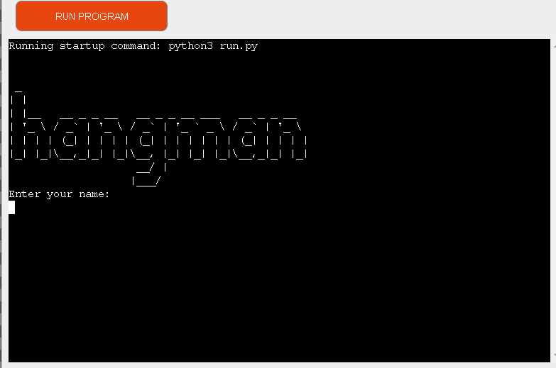

# Hangman Game
* Hangman game is a python terninal game,which runs in the Code Institue terminal on Heroku

* The goal of the game is to challenge the user to have to guess the hidden words before he runs out of life.

* Here is the live version of my project.

 

 ## How to play
* First enter your name(you will be greeted my hangman)
* You will have six attempts to guess the word
* You will be asked to guess a letter
* This generates as many blanks as letters in the word
* If guessed letter in word,it will replace the blank with the letter
* If the guessed letter not in word you loose a life
* If you guessed all the correct words you win.
* If you guess wrong all 6 letters you loose and the guessed word is showed in the command pannel.

## Testing
I have tested in my local terminal and the Heroku terminal

## Credits
* README Code institute
* Priyam youtube

## Deployment
This project was deployed using codeinstitue mock terminal for Heroku.
### Steps for deployment
* Fork or clone this repository
* Create a new Heroku app
* Set the buildbacks to pythn and node.js
* link the Heroku app to this repository
* click on deploy 

